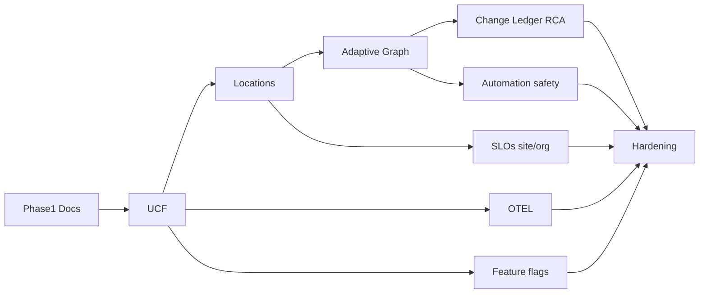

# 05 — Migration Plan (Additive Only) — Phases 2–10

**Phase:** 1 planning artifact  
**Rules:** Additive schema only · no DB reset · no production behaviour change until a phase’s verification gate passes · predictions remain gated · light theme preserved · industry examples stay adapters.

---

## Overview

| Phase | Theme | Primary outcomes |
|-------|-------|------------------|
| **1** | Assessment | Architecture docs (this folder) — **COMPLETE** |
| **2** | Universal Connection Framework (UCF) | Connection abstract over ingest + integrations; shared enum align |
| **3** | Locations / Sites | Region + Location entities; System↔Location; deployment modes |
| **4** | Adaptive Operational Graph | Evidence graph across Location; component roles |
| **5** | OTEL / Approach B deepening | Collector receiver; correlate with heartbeats/checks |
| **6** | Change Ledger + RCA | Formal ledger APIs/UI; RCA pipeline on facts |
| **7** | SLOs at site & org | Location-scoped SLOs; roll-up budgets |
| **8** | Automation safety | Location blast-radius; safer defaults; scoped executors |
| **9** | Feature flags & entitlements | Org/runtime flags; predictions stay dual-gated |
| **10** | Hardening & portfolios | Multi-site UX polish; migration clean-up; example onboarding packs |

Phases may partial-overlap in planning, but **ship gates are sequential** for schema that later phases depend on (3 before 4 location edges; 2 before 5 OTEL connection types).

---

## Phase 2 — Universal Connection Framework

**Goal:** One product “Connection” concept for any industry System.

**Additive work (conceptual):**

- Connection DTO/API that fronts: Project ingest credentials, `ProjectIntegration`, future OTEL endpoint.
- Monitoring Profile registry (JSON definitions) without customer-specific Prisma enums.
- Align `packages/shared` enums with Prisma (`ProjectStatus`, generic event keys).
- Connect wizard steps renamed to connection-framework language; keep existing HMAC flow.

**Verification:** Connect journey e2e still passes; signing required; no prediction emission.

**Does not include:** Location schema (Phase 3).

---

## Phase 3 — Locations / Sites (Branch-aware)

**Goal:** Implement design in [08-branch-aware-location-design.md](./08-branch-aware-location-design.md).

**Additive schema (outline only):**

- `Region` (optional)
- `Location` (`type`: BRANCH | SITE | …, `mode` inheritance)
- Org `topologyMode`: CENTRALISED | DISTRIBUTED | HYBRID
- `Project.locationId` nullable FK (System sits at a Location; null = org-central)
- Optional `LocationMembership` / multi-home later

**Health:** Site roll-up vs org roll-up rules from §08.

**Verification:** Creating Locations does not break existing Projects with null locationId; layer-health unchanged for legacy projects.

---

## Phase 4 — Adaptive Operational Graph

**Goal:** Graph that adapts to Centralised / Distributed / Hybrid topologies.

**Work:**

- Location-scoped dependency queries; optional cross-site edges with explicit criticality.
- Component `role` metadata (replace brittle name heuristics gradually).
- Evidence strengthening from observations/checks (no invented edges).
- UI topology filters: Org / Region / Location / System.

**Verification:** Existing project topology pages unchanged when Location filter = “all / unbound”.

---

## Phase 5 — OTEL & collector path (Approach B)

**Goal:** Explicit mapping completion for Approach B in [07](./07-approach-a-vs-b.md).

**Work:**

- OTEL receiver endpoint(s) behind UCF Connection type `OTEL`.
- Correlation IDs linking traces ↔ Event/Heartbeat/CheckResult.
- Storage strategy: sampled raw + derived observations (retention-aware).
- Worker job for batch processing if needed.

**Verification:** Agentless-only customers unaffected; OTEL optional entitlement.

---

## Phase 6 — Change Ledger & RCA

**Goal:** Promote `ChangeEvent` / `DeploymentRecord` into a first-class Change Ledger; deepen RCA.

**Work:**

- Ledger list/filter API (already partial via change-events routes).
- Mandatory linkage of privileged remediations to ChangeEvents.
- RCA narrative assembly from: checks, heartbeats, graph evidence, ledger, memory — still no fake AI.
- Postmortem export (see diagnosis roadmap).

**Verification:** Causal graph remains evidence-backed; LLM still opt-in.

---

## Phase 7 — SLOs (site & org)

**Goal:** SLO definitions attachable to System, Location, or org portfolio.

**Work:**

- Additive `targetType` expansions (LOCATION, ORGANIZATION) on `SLODefinition`.
- Burn-rate job location-aware aggregations.
- UI: site error budget vs org rolled budget (Hybrid: show both).

**Verification:** Existing SERVICE/PROJECT SLOs continue to compute.

---

## Phase 8 — Automation safety

**Goal:** Multi-site-safe automation.

**Work:**

- Scope AutomationRun to Location/System; inherit maintenance windows.
- Deny high-risk actions across Locations without dual approval.
- Keep OBSERVE default; autonomous still entitlement + policy + env gated.
- Industry action packs via profile — not hardcoded Noble actions.

**Verification:** Auto-heal / autonomous jobs no-op without policy; exclusive locks persist.

---

## Phase 9 — Feature flags

**Goal:** Unify commercial entitlements + runtime flags.

**Work:**

- Org-level feature flag store (additive) for gradual rollout.
- Keep `OPSWATCH_PREDICTIONS_ENABLED` as hard platform kill-switch AND entitlement/flag AND confidence gate.
- Flags for: advanced topology, OTEL ingest, location UI, autonomous modes.

**Verification:** Flags default OFF for new risky surfaces; existing behaviour preserved.

---

## Phase 10 — Hardening & portfolio UX

**Goal:** Production-ready multi-site experience without regressions.

**Work:**

- Applications portfolio shows Location chips; org vs site health.
- Docs packs: “example industry” onboarding (Noble as example profile).
- Retention/perf for OTEL + multi-location indexes.
- Remove temporary dual-write shims only after dual-read period.

**Verification:** Full checklist in [06](./06-implementation-checklist.md); release checklist Intelligence still green with predictions OFF.

---

## Cross-cutting migration principles

1. **Nullable FKs first** — attach Location to Project optionally.
2. **Dual-read** when renaming fields or introducing eventKey alongside EventType.
3. **Feature-flag UI** — hide incomplete Location UX until Phase 3 gate.
4. **No push/deploy** from assessment phases; operator chooses ship windows.
5. **Do not touch** StarLiz / TrueNumeris / Noble remotes for core platform work.

---

## Dependency sketch

